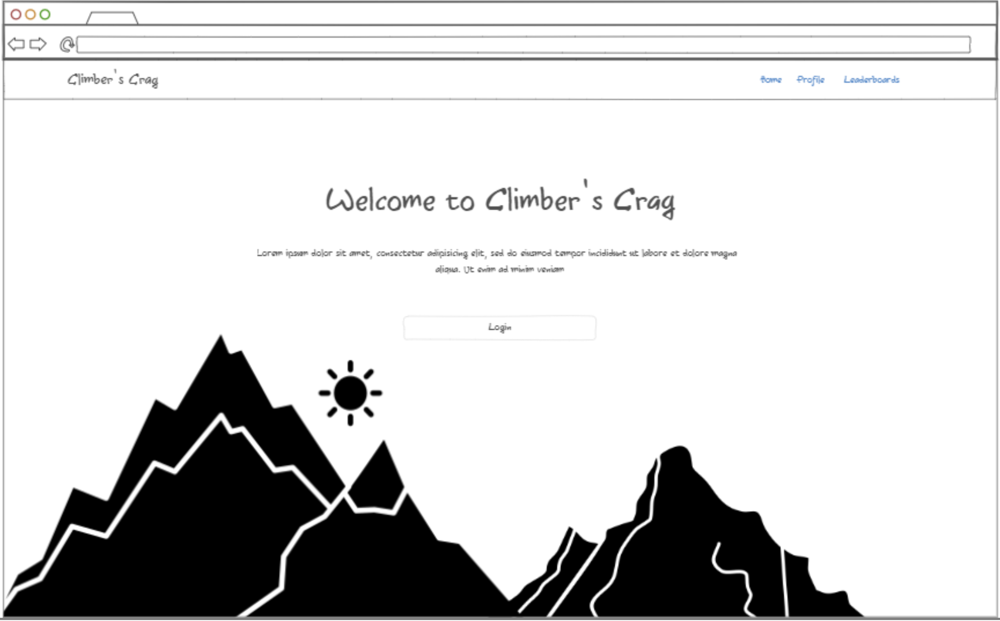
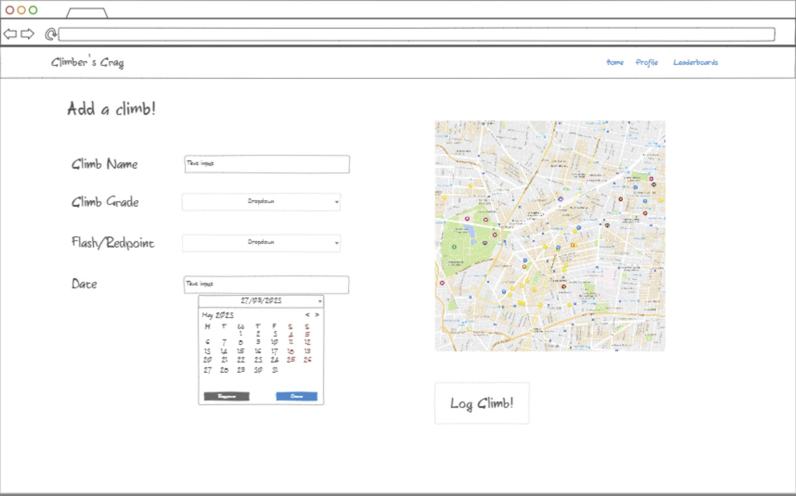
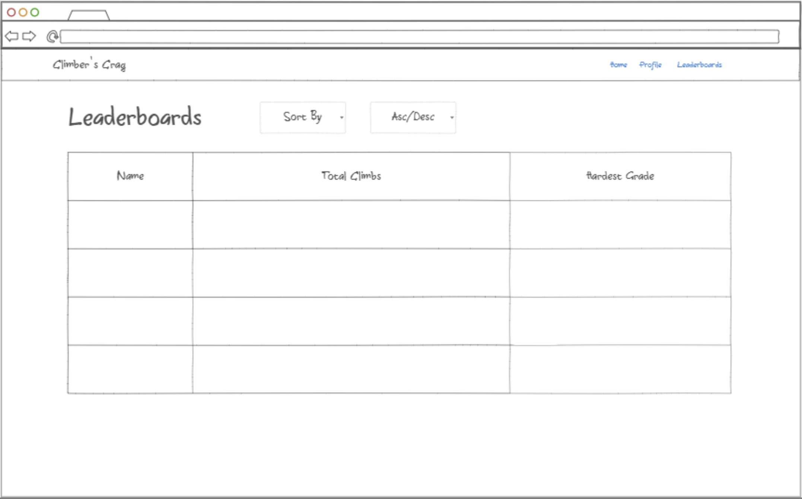

# Climber's Crag

## Description Deliverable

### Elevator Pitch

It's a hot fall afternoon, and unfortunately, you and your friends got into an argument while rock climbing over who was the best climber. Well, don't worry, because with Climber's Crag, you can log your climbs and compare your stats with a friend! Now you can **PROVE** to your friend that you are a better climber.

### Key Features

- Secure login using HTTPS
- Ability to log information about different climbs (i.e. grade, flash/on-site/redpoint, date, location data)
- Uses Google Maps to collect and store location data
- Displays both personal data in the form of logged climbs and global leaderboards with user statistics.
- User can edit and delete logged climbs after they are created.
- Leaderboards can be focused/sorted to view stats in an ascending/descending rank.

### Technologies

- **HTML:** Uses HTML to structure the webpage. There will be a login page, a page to collect data from the user, and a page to display different statistics.
- **CSS:** For general styling, working with HTML.
- **JavaScript:** For login and displaying statistics.
- **Authentication:** Register and login users. Storing user information in a secure database.
- **Database data:** User data will be stored in the database, such as climbs logged, types of climbs, etc.
- **WebSocket data:** WebSockets, such as GoogleMaps, will be used to collect information like the location of logged climbs. Leaderboards will also update in real-time when users input new data.

### Sketches
| Home Page             | Login Popout         | Add Climb Page         | Leaderboard Page      |
|-----------------------|----------------------|------------------------|------------------------|
|  |  |  |  |

Note: there will be a user page very similar to the leaderboard page, except the table will be populated with the specific user's data.

## HTML Deliverable

This update created an HTML frame to start the website.

- [x] **HTML pages** - There are four main HTML pages, including a home/login page, profile, leaderboards, and a page to add climb data.
- [x] **Links** - There are navigation links that link to the separate pages, including a temporary link to a registration form. This will eventually be replaced with a pop-up form.
- [x] **Text** - There are titles on the different pages and text to help describe data placeholders.
- [x] **Images** - There is a logo image, more images will be added later in the CSS deliverable as background images. 
- [x] **Login** - Input box and submit button for login. There is also a placeholder for a register form as well. All login/form buttons currently link to different points on the website (i.e. login links to `profile.html` and register links to `index.html` to login.)
- [x] **Database** - Table placeholders on `profile.html` and `leaderboards.html` represent where the database will be shown.
- [x] **WebSocket** - There is an image placeholder on `add-ascent.html` to represent communication with Google Maps to collect location data on entered climbs.

## CSS deliverable

This update added CSS and Bootstrap styles to the website.

- [x] **Header, footer, and main content body** - Each page has a header and main content body. The index.html footer is fixed while other pages have the footer at the end of the main div.
- [x] **Navigation elements** - Each page has a navbar that links to the other pages. The add-ascent page is accessed through a button on the profile page. Currently, buttons that will require JS to add a climb, login, or register do not link to other pages. This will be added when the database is set up.
- [x] **Responsive to window resizing** - All pages respond to window sizing, formatting the grids correctly. The background also responds to the size of the content, filling the whole screen.
- [x] **Application elements** - Whitespace is utilized to prevent the page from feeling crowded.
- [x] **Application text content** - Fonts are consistent throughtout the site.
- [x] **Application images** - Included a favicon for the icon in each page title. Each page also has a background image that responds to the size of the website.

## JS deliverable

This update added some basic JS and functionality to the website.

- [x] **Login** - Added support for both login and register. When you provide information and submit it, a User is created and stored in local memory. You are unable to go to `profile.html` without a User stored. After logging in, the user is redirected to the `profile.html` page.
- [x] **Database** - When the user logs in or registers, their email is displayed on their profile. This will be replaced with their username once an actual database can be created. The profile page has some placeholder information for stats about the user. It also displays a climbing log, which reads data from a JSON file and sorts according to the Yosemite Decimal System. The `leaderboard.html` table is similar to the climbing log.
- [x] **WebSocket** - Currently, the plan is to get location data from the `Add an Ascent` form and display it on the user's profile. Without access to the Google Maps API, I am unable to do this currently, but a Google Map iframe was inserted as a placeholder.
- [x] **Application Logic** - In addition to the above, to populate the climbing log and leaderboard with data, the user can input data in the `Add an Ascent` form, which creates an `Ascent` object and stores it in local memory. The plan is to eventually use these objects to populate the database.

## Service deliverable

This deliverable sets up an api and uses the api to transfer data between different locations on the website, such as adding climb data, location data using GoogleMaps API, and login data

- [x] **Node.js/Express HTTP service** - done!
- [x] **Static middleware for frontend** - done!
- [x] **Calls to third party endpoints** - uses GoogleMaps api to render a map, get location data, and communicated with the backend to save climb location data specific to the user. To see some example data, use the username: John Smith, and password: password.
- [x] **Backend service endpoints** - Login is pretty much implemented, new users can be created and verified. Existing users' data is stored. All data is stored and fetched from the api endpoints. Tables are generated using the api.
- [x] **Frontend calls service endpoints** - I used fetch to render the tables, and used POST / GET requests to add and modify objects in the backend.

## Database deliverable

For this deliverable, I created a MongoDB database to store data as opposed to static objects in the server.

- [x] MongoDB Atlas database created - done!
- [x] Endpoints for data - Every endpoint interacts the the DB and stores/updates the data in MongoDB.
- [x] Stores data in MongoDB - done!